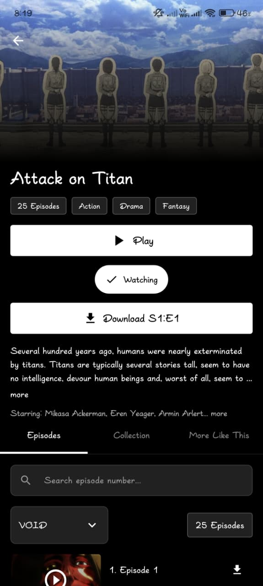
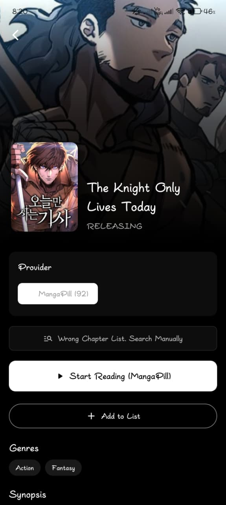
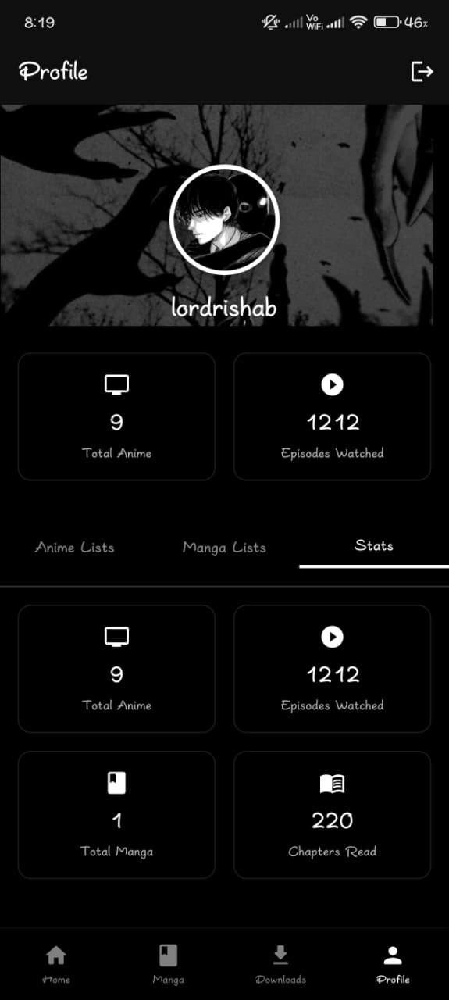
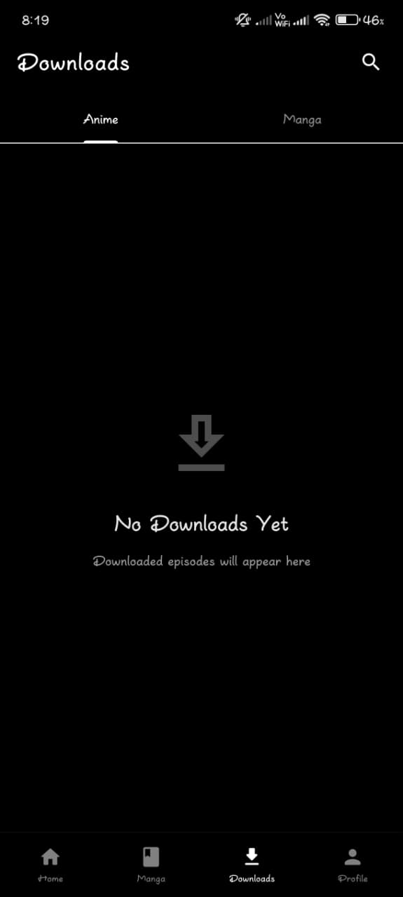
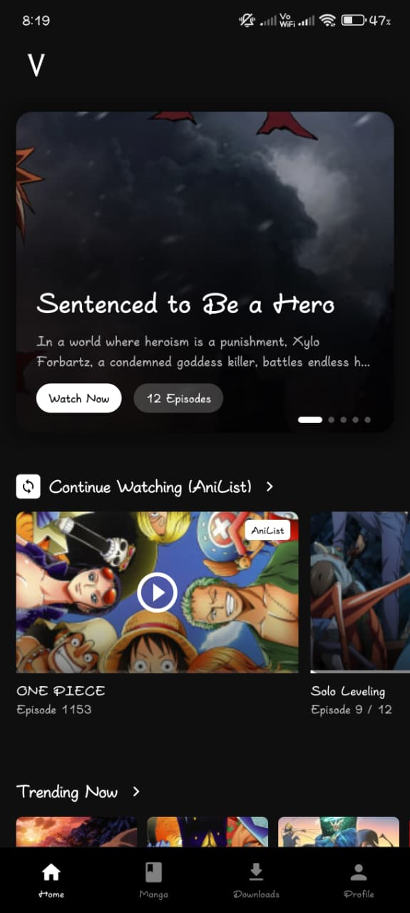
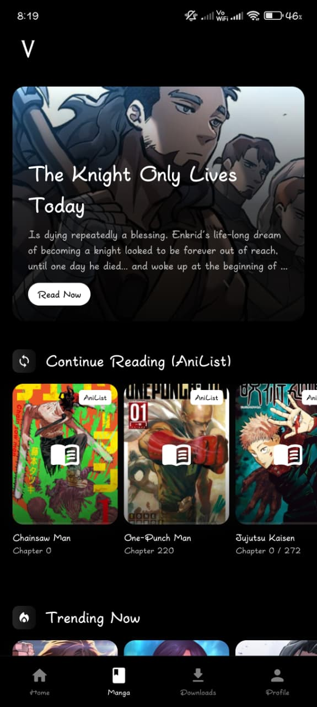

# 🌌 **VoidAnime** 🌌
### *Enter the Void. Experience Anime & Manga in Radical Style.*

---

<!-- Download Badge/Button Placeholder -->

 

## ⚠️ **IMPORTANT NOTICE** ⚠️
### **THIS PROJECT IS NOT OPEN SOURCE.**
**This repository is hosted on GitHub solely for the purpose of distributing the APK and release notes.**
You are not permitted to modify, distribute, or use the source code for commercial purposes.

---

## ✨ **About The App**

VoidAnime is not just an app; it's an experience. Dive into a massive library of Anime and Manga with a User Interface designed to stun. 

*   **Radical Aesthetics**: A completely unique, monochrome "Void" design.
*   **Seamless Streaming**: High-quality playback with custom subtitles.
*   **Read & Watch**: Switch between Manga and Anime effortlessly.
*   **Track Your Progress**: Sync with AniList (or local tracking).

---

## 📸 **Visual Preview**

*Witness the void.*

  
 
 
 
 
 

---

### 🚀 **Ready to Dive In?**

[**⬇️ DOWNLOAD THE LATEST APK ⬇️**](https://github.com/voidbornfr/voidanime-mobile/releases)

